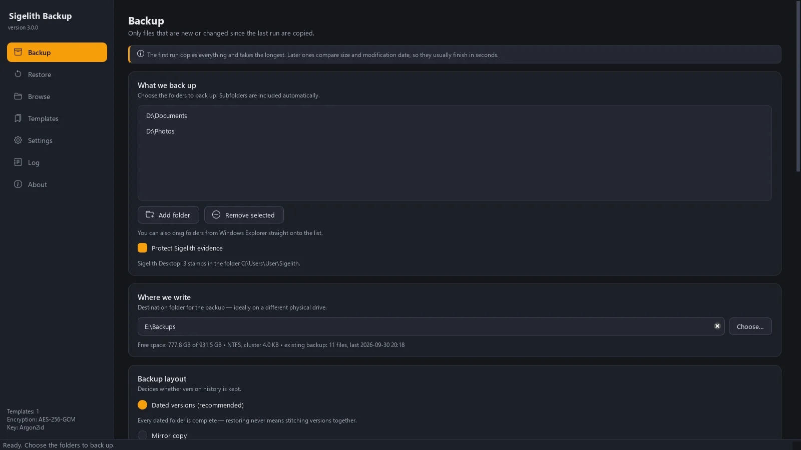
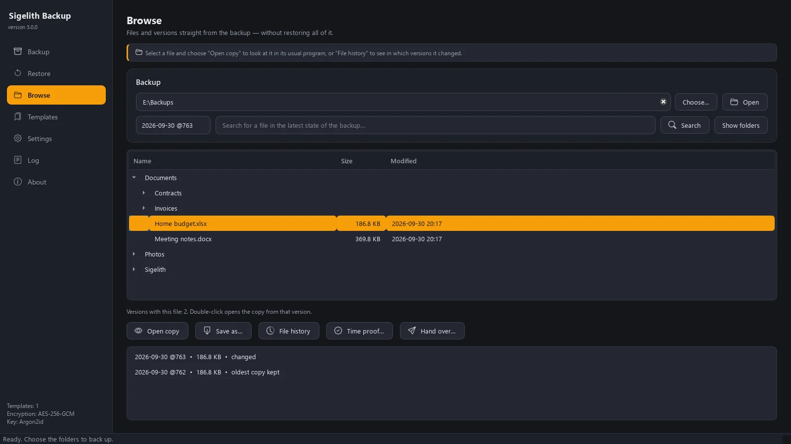
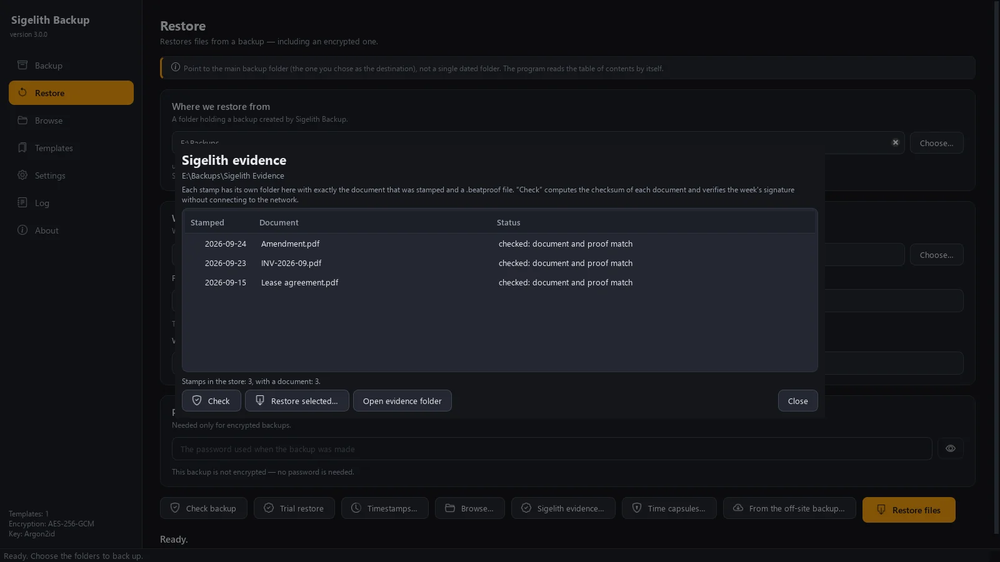

# Sigelith Backup

Versioned, optionally encrypted backups of your folders on an external drive — for
Windows. Browse any version like a folder, restore just what you need, and recover
your files even without this program. No account, no ads, no telemetry. Interface in
English and Polish.

   

**Polski:** [README.pl.md](README.pl.md) · **Website:** <https://sigelith.org/backup/>

Sigelith Backup is the companion app of [Sigelith](https://sigelith.org) — a public,
free proof-of-existence log. The backup works on its own; the Sigelith features are
optional and send nothing but hashes.

| Backups at a glance | Browse any version like a folder | Sigelith evidence, kept apart |
|---|---|---|
|  |  |  |

Security reports: [SECURITY.md](SECURITY.md).

---

## What it does

| Feature | |
|---|---|
| **Setup wizard** | Five steps — what to protect, where (detected drives, rated), how strongly, when — and the outcome is shown before anything is copied. |
| **Complete dated versions** | Every run creates a complete, dated folder. Unchanged files are hard links, so the history takes only as much space as what actually changed (NTFS). |
| **Incremental and move-aware** | Only new and changed files are written. Moved or renamed files and folders are re-linked, not copied again — SHA-256 decides, never size alone. |
| **Large files in chunks** | Files from 256 MB (virtual machines, mail archives) are split by content (FastCDC); a new version stores only the changed chunks. |
| **Encryption** | AES-256-GCM with the key derived from your password by Argon2id; the file header is authenticated. The password cannot be recovered or reset — by design. |
| **Browse without restoring** | Open any version like a folder, open or save a single file (also from an encrypted backup), see in which versions a file changed, search by name. |
| **Restore** | Everything, one folder, or files back to their original locations, with a chosen policy for name conflicts. |
| **Scheduled backups** | Daily at a set time or when the backup drive is connected; runs in the background and starts with Windows. |
| **Live backup** | Watches the source folders and tops up today's version a few minutes after you save; when the backup drive is connected, it catches up at once. One version per day — with timestamps, closed by a seal the next day, and never changed after that. |
| **Retention** | All versions, the last N, or a calendar (newest per day / week / month). Incomplete versions are never deleted. |
| **Ransomware tripwire** | When many files suddenly look encrypted or get a foreign extension, the backup pauses and asks before writing — good versions are not overwritten. |
| **Locked files** | Files held open by another program are retried at the end and reported with the name of the program holding them. |
| **Trial restore** | A random sample is restored to a temporary folder and compared with the source — the whole recovery path in minutes. |
| **Recovery without the app** | Every backup folder carries a bilingual note and a standalone script (`odzyskaj.py`, plain Python) that restores and decrypts the files. |
| **Off-site copy** | Optional snapshots to S3-compatible storage (Amazon S3, Backblaze B2, MinIO), encrypted on your computer with a separate password. |
| **Interruption-safe** | A file gets its final timestamp only after its data is on the drive; progress is checkpointed, so an interrupted run — even a power cut — is resumed, not restarted. |

### With Sigelith (optional)

| Feature | |
|---|---|
| **Protect Sigelith evidence** | Backs up the Sigelith Desktop data folder and keeps every stamped document exactly as it was stamped, checked against its hash, together with its `.beatproof` file, in a separate store that retention never cleans up. |
| **Timestamped versions** | Each version can be sealed in the public Sigelith log: only the SHA-256 of a statement over the version's file list and file tree is sent. The weekly signature is checked with a key built into the program. |
| **A time proof for any file** | Any file of a sealed version gets its own small proof (`.sigelith-proof`, format `sigelith-file-proof-v1`) and a PDF certificate — a Merkle path with salted leaves, so the proof reveals nothing about the other files. Checked by [Sigelith Desktop](https://github.com/DeiFlagellum/sigelith-desktop) and <https://sigelith.org/verify/>. |
| **Content audit** | Reads every file of a version back from the drive and compares it with the hashes sealed in the public log — not with the file list stored next to them, which could be forged too. “Last untouched” points to the newest version that still matches its seal. |
| **Hand over with proof of delivery** | Any version of a file goes straight to Sigelith Handover in Sigelith Desktop; the recipient confirms receipt with their own key. |
| **Time capsule** | Seals a folder until a date of your choice (format `beattime-seal-v1`, the same as <https://sigelith.org/capsule/>). Any two of three parts open it: the drand round for that moment, the Sigelith key server's share — released only after the date, by the operator's policy rather than by cryptography — and the recovery code, which is saved next to the capsule. Whoever holds the backup therefore needs only the operator to break its policy to open it early. Sealing works offline; the capsule stays in your backup. |

---

## Privacy

Nothing is sent over the internet unless you turn on one of two optional features:
the off-site copy (encrypted on your computer, sent directly to your own storage) or
Sigelith timestamps (only a SHA-256 hash goes to sigelith.org). Everything else —
including “Protect Sigelith evidence”, file proofs, audits and time capsules — works
entirely on your computer. Privacy policy: <https://sigelith.org/privacy/>.

## Get it

- **Microsoft Store** — coming soon. The Store package is this program as MSIX and updates itself.
- **From source** (Windows 10 22H2 / 11, Python 3.11+; the release is built with 3.12):

```powershell
py -3.12 -m venv .venv
.venv\Scripts\pip install -r requirements.txt
.venv\Scripts\python app.py
```

## Build

```powershell
.venv\Scripts\pip install pyinstaller
.venv\Scripts\pyinstaller cleanvault.spec --noconfirm --clean   # dist\SigelithBackup.exe
.venv\Scripts\python tools\build_msix.py                         # MSIX package, see packaging\msix\README.md
```

Third-party notices are generated from the installed dependencies
(`tools\third_party_notices.py`); the build stops when they are out of date.

## Tests

```powershell
.venv\Scripts\python -m pytest
```

The suite runs without a desktop (Qt `offscreen`) and includes regression tests for
every bug fixed since 1.x. A few interoperability tests use the Sigelith repository
when it sits next to this one (or `SIGELITH_REPO` points to it) — for example, a time
capsule sealed by this program is opened by the same JavaScript modules that run on
sigelith.org/capsule/; without it they are skipped.

## In the backup folder

| What | Where |
|---|---|
| Dated versions | `2026-09-17_@687` — UTC date and time in @beat (1000 beats per day, anchored to UTC); a topped-up version adds a second date after `--` |
| Table of contents | `.cleanvault-manifest` (+ `.summary`, `.journal`) |
| Chunks of large files | `.cleanvault-chunks\`, recipes `*.cvrecipe` in the version folder |
| Encrypted files | `*.cvlt` — `CVLT` header (authenticated as AAD) · ciphertext · 16-byte GCM tag |
| Version seal | `.cleanvault-index.txt`, `.cleanvault-seal-statement.txt`, `.cleanvault-seal.json` |
| Sigelith evidence | `Sigelith Evidence\` — stamped documents with their `.beatproof` files |
| Time capsules | `Sigelith Capsules\` — `.beatseal.json` (+ `.bin`) and the recovery-code note |
| Recovery | `JAK ODZYSKAC DANE - HOW TO RECOVER.txt` and `odzyskaj.py` |

File names keep the `.cleanvault` prefix of the program's first name, so backups made
by earlier versions keep working. Settings live in `%LOCALAPPDATA%\Sigelith Backup`
(the Store version: in its package folder); saved passwords in Windows Credential Manager.

## Project layout

```
app.py                  entry point
cleanvault/             engine (no Qt): scanning, manifest, copy, chunks, crypto,
                        restore, retention, schedule, S3 off-site copy, Sigelith
                        timestamps, file proofs, audit, evidence store, time capsules
cleanvault/ui/          PySide6 interface (wizard, browsing, background mode)
cleanvault/locale/      translations (Polish in the code, English catalog)
assets/                 icons (Bootstrap Icons, MIT), recovery script, legal texts
packaging/              MSIX manifest and license texts of bundled components
tests/                  test suite
tools/                  MSIX build, third-party notices, Store screenshots, benchmark
```

## License

© 2025–2026 Adam Koch. **Free software under the GNU GPL, version 3 or (at your option)
any later version** — see [LICENSE](LICENSE) and [assets/legal/LICENSE.txt](assets/legal/LICENSE.txt).
The license covers the code, not the name: the name “Sigelith” and the logo are not
licensed (section 7(e)), so a modified version may be distributed under a different name.

Third-party components keep their own licenses — Qt and PySide6 (LGPL-3.0), Python (PSF)
and libraries under MIT, BSD and Apache-2.0: [assets/legal/THIRD-PARTY-NOTICES.txt](assets/legal/THIRD-PARTY-NOTICES.txt).

Until 2026-09-30 the program was called Time Vault Backup (earlier CleanVault).
