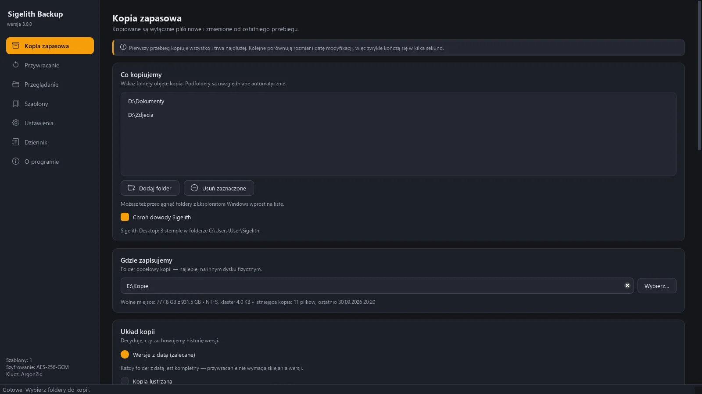
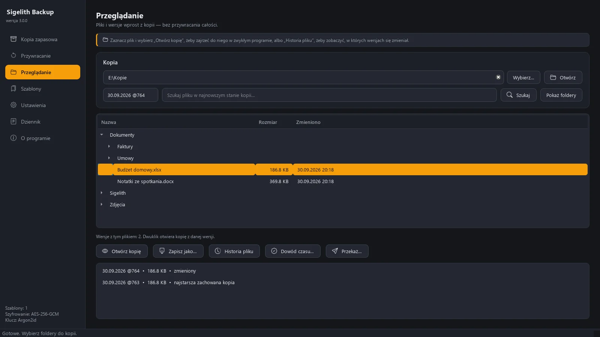
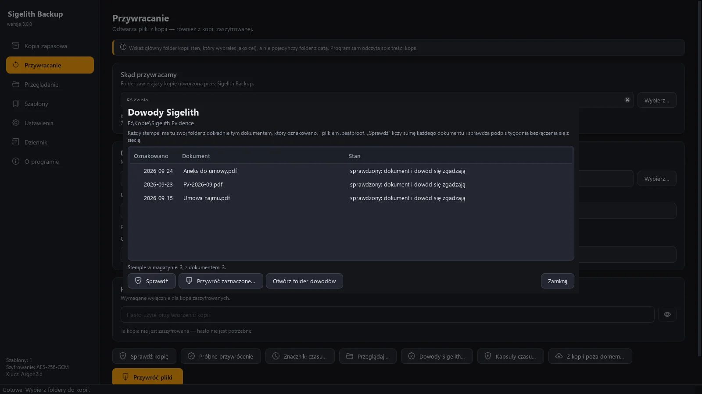

# Sigelith Backup

Kopie zapasowe folderów na dysk zewnętrzny — z historią wersji, szyfrowaniem
AES-256-GCM i przywracaniem jednym kliknięciem. Bez konta i bez telemetrii:
z internetem łączą się wyłącznie dwie funkcje, które trzeba samemu włączyć
(kopia poza domem i znaczniki czasu Sigelith). Interfejs w 11 językach — tych samych
co Sigelith Desktop i sigelith.org.

  

**English:** [README.md](README.md) · **Strona:** <https://sigelith.org/backup/>

| Kopie w skrócie | Przeglądanie wersji jak folderu | Dowody Sigelith osobno |
|---|---|---|
|  |  |  |

Zgłoszenia bezpieczeństwa: [SECURITY.md](SECURITY.md).

---

## Co potrafi

| Funkcja | Opis |
|---|---|
| **Kreator** | Pięć kroków: co chronić, gdzie (wykryte dyski z oceną), jak mocno (trzy profile), kiedy, a na koniec skutki — zanim cokolwiek ruszy. Ekran powitalny przy starcie prowadzi do najczęstszych czynności. |
| **Kopia przyrostowa** | Zapisywane są wyłącznie pliki nowe i zmienione. Porównanie opiera się na spisie treści kopii, rozmiarze i dacie modyfikacji; przy różnicy liczona jest suma SHA-256. |
| **Przeniesione pliki bez kopiowania** | Przeniesienie albo przemianowanie pliku lub całego katalogu nie przesyła danych: plik jest w kopii podpinany dowiązaniem pod nową ścieżką. Kandydata wskazuje rozmiar i czas modyfikacji, ale decyduje suma SHA-256 — dwa różne pliki tej samej wielkości nie zostaną pomylone. |
| **Wersje z datą** | Każdy przebieg tworzy kompletny folder z datą. Pliki niezmienione są podpinane twardym dowiązaniem, więc historia zajmuje tyle, ile realnie się zmieniło. |
| **Nazwy wersji w BeatTime** | Katalog wersji nazywa się `2026-09-17_@687`, a po uzupełnieniu `2026-09-17_@687--2026-09-24_@921`: data utworzenia i data ostatniego uzupełnienia. Widać to w Eksploratorze bez uruchamiania programu. BeatTime to 1000 beatów na dobę (1 beat = 86,4 s) z kotwicą w UTC, więc data w nazwie też jest datą UTC. |
| **Trudne nazwy plików** | Pliki o nazwach zarezerwowanych przez Windows (`nul`, `con`, `aux`) i z kropką albo spacją na końcu — takie tworzy Linux i przekierowania powłoki — są kopiowane i przywracane normalnie. |
| **Szyfrowanie** | AES-256-GCM, klucz z hasła przez Argon2id. Nagłówek pliku uwierzytelniony jako AAD. |
| **Zapis różnicowy dużych plików** | Pliki od 256 MB (maszyny wirtualne, archiwa poczty) są dzielone na fragmenty wyznaczane treścią (FastCDC); nowa wersja zapisuje tylko zmienione fragmenty. Zmiana w pliku 2 GB kosztuje dziesiątki MB zamiast 2 GB. |
| **Kopia równoległa** | Wiele plików naraz (domyślnie do 32). Przy setkach tysięcy małych plików czas kopii to głównie opóźnienia na każdy plik — otwarcie, skanowanie antywirusowe, zapis na nośnik — a nie przesył danych. |
| **Weryfikacja odroczona** | „Przywracanie” → „Sprawdź kopię” porównuje każdy plik z sumą SHA-256 zapisaną podczas kopii. Uruchomiona po ponownym podłączeniu dysku czyta dane faktycznie z nośnika. Weryfikacja natychmiast po zapisie jest opcjonalna — czyta zwykle z pamięci podręcznej i wydłuża kopię nawet dwukrotnie. |
| **Wykluczenia jak w `.gitignore`** | Wzorzec `node_modules/*` pomija każdy katalog `node_modules`, na dowolnej głębokości. Domyślnie pomijane są m.in. `venv`, `.venv`, `__pycache__`, `node_modules`; historia Git (`.git`) jest kopiowana. |
| **Podgląd zmian** | Pokazuje dokładny plan przed zapisaniem czegokolwiek. |
| **Szablony** | Zapamiętane konfiguracje uruchamiane jednym kliknięciem. Hasła trafiają do Menedżera poświadczeń Windows, nigdy do plików programu. |
| **Przywracanie** | Trzy układy: pełna struktura, jeden folder, pierwotne lokalizacje. Wybierana polityka konfliktów nazw. |
| **Przeglądanie bez przywracania** | Ekran „Przeglądanie” pokazuje każdą wersję jak folder; pojedynczy plik otwiera się z kopii (także zaszyfrowanej) albo zapisuje we wskazanym miejscu. Historia pliku mówi, w których wersjach się zmieniał; wyszukiwarka znajduje plik po nazwie. |
| **Kopie planowe** | Codziennie o godzinie albo po podłączeniu dysku. Program działa w tle przy zegarze, startuje przy logowaniu i przypomina, gdy kopii dawno nie było. |
| **Na bieżąco** | Program obserwuje foldery źródłowe i kilka minut po zapisie dogrywa zmiany do dzisiejszej wersji; po podłączeniu dysku z kopią synchronizuje od razu. Jedna wersja na dzień — ze znacznikami czasu zamykana pieczęcią następnego dnia i potem już nietykana. Przy podejrzanie dużej liczbie zmian (ransomware?) dogrywki czekają na człowieka. |
| **Retencja** | Wszystkie wersje, ostatnie N albo kalendarz: najnowsza wersja z każdego z ostatnich dni, tygodni i miesięcy. Niedokończonych wersji program nie kasuje nigdy. |
| **Ochrona przed ransomware** | Gdy w źródle nagle zmienia się podejrzanie dużo plików (treść wygląda na zaszyfrowaną albo pliki dostały obce rozszerzenie), kopia wstrzymuje się przed zapisem i czeka na decyzję — dobre wersje nie zostaną nadpisane zaszyfrowanymi. |
| **Pliki zablokowane** | Plik otwarty na wyłączność przez inny program jest ponawiany na końcu kopii, a jeśli dalej jest zajęty — wykazywany z nazwą programu, który go trzyma. |
| **Próbne przywrócenie** | Losowa próbka plików przywracana do katalogu tymczasowego i porównywana ze źródłem — sprawdza całą drogę odzyskiwania w kilka minut. |
| **Notatka ratunkowa** | W katalogu kopii leży `JAK ODZYSKAC DANE - HOW TO RECOVER.txt` i skrypt `odzyskaj.py` — dane da się odzyskać samym Pythonem, bez tego programu. |
| **Kopia poza domem** | Opcjonalnie: migawki w usłudze zgodnej z S3 (Amazon S3, Backblaze B2, MinIO), szyfrowane na komputerze osobnym hasłem; usługa widzi tylko nieczytelne fragmenty. Przywracanie także na nowym komputerze. |
| **Dowody Sigelith** | Opcja „Chroń dowody Sigelith”: folder danych Sigelith Desktop (historia stempli) dochodzi do źródeł, a każdy oznakowany dokument — dokładnie w postaci, którą oznakowano, sprawdzonej sumą — trafia do magazynu `Sigelith Evidence` w katalogu kopii razem z plikiem `.beatproof`. Dokument zmieniony po stemplu program odnajduje w starszych wersjach kopii. Magazynu retencja nie sprząta; okno „Dowody Sigelith…” sprawdza dowody bez sieci i odtwarza dokumenty. |
| **Znaczniki czasu Sigelith** | Opcjonalnie: do publicznego rejestru Sigelith (sigelith.org, dawniej BeatTime) trafia wyłącznie skrót SHA-256 pieczęci wersji — sumy spisu plików i korzenia drzewa plików; podpis tygodnia sprawdzany kluczem wpisanym w program, bez ufania serwerowi. |
| **Dowód czasu dla każdego pliku** | Od 3.0: przy dowolnym pliku z dowolnej oznakowanej wersji „Przeglądanie → Dowód czasu…” zapisuje mały plik dowodu (`.sigelith-proof`, format `sigelith-file-proof-v1`) i certyfikat PDF: ten plik był w kopii w chwili oznakowania — bez ujawniania innych plików (drzewo Merkle'a z solą liści). Sprawdza go Sigelith Desktop i strona sigelith.org/verify/. |
| **Kopia, której nie da się po cichu podmienić** | Od 3.0: „Znaczniki czasu → Audyt treści” czyta z nośnika każdy plik wersji (po odszyfrowaniu i złożeniu fragmentów) i porównuje z sumami oznakowanymi w publicznym dzienniku Sigelith — wzorcem jest pieczęć, nie spis treści obok plików, więc podmiany nie ukryje nawet podrobiony spis. „Ostatnia nietknięta” wskazuje najnowszą wersję zgodną z pieczęcią. Po każdej kopii z pieczęcią program sam sprawdza próbkę starszej, podpisanej wersji. |
| **Przekazanie z kopii z dowodem doręczenia** | Od 3.0: „Przeglądanie → Przekaż…” zapisuje wybraną wersję pliku (np. umowę z marca) i otwiera ją w Sigelith Handover (Sigelith Desktop 3.0.1+, alias `sigelith-desktop.exe --handover`): odbiorca potwierdza odbiór własnym kluczem, a chwila doręczenia trafia do publicznego dziennika. Bez Sigelith Desktop program mówi, skąd go wziąć. |
| **Kapsuła czasu w kopii** | Od 3.0: „Przywracanie → Kapsuły czasu…” pieczętuje wybrany folder do daty (format `beattime-seal-v1`, ten sam co sigelith.org/capsule/). Kapsułę otwierają dowolne dwie z trzech części: runda drand z tej chwili, udział serwera kluczy Sigelith — wydawany dopiero po dacie, co jest zasadą operatora, a nie wymogiem kryptografii — i kod odzyskiwania. Kapsuła leży w kopii (folder `Sigelith Capsules`), nie na serwerze; obok niej kod odzyskiwania, który zastępuje jeden z kluczy, gdyby po dacie był niedostępny. Kto ma kopię, ma więc i kod: do wcześniejszego otwarcia wystarczy mu, że operator złamie swoją zasadę. Otwiera ją strona sigelith.org/capsule/. |
| **Odporność na przerwania** | Plik dostaje czas modyfikacji źródła dopiero po utrwaleniu danych na nośniku, więc przerwany zapis nigdy nie wygląda na kompletny. Istniejący plik jest zastępowany przez plik tymczasowy, nigdy nadpisywany w miejscu. Postęp trafia co kilka sekund do dziennika punktów kontrolnych — przerwanie kopii, także wyłączenie komputera, trwa ułamek sekundy i nie gubi informacji o tym, co już zapisano. |
| **Wznawianie i uzupełnianie** | Przerwaną kopię można dokończyć: przy ponownym uruchomieniu program sam proponuje uzupełnienie niedokończonej wersji zamiast tworzenia nowej, pełnej. Do wybranej wersji dogrywane są tylko brakujące i zmienione pliki; to, co już w niej leży, jest rozpoznawane bezpośrednio z nośnika, więc działa nawet bez spisu treści. |
| **Dogrywka zmian** | Kopia wielu gigabajtów trwa godzinami, a źródło w tym czasie żyje. Po głównym przebiegu źródło jest skanowane ponownie i nowe lub zmienione pliki trafiają do tej samej wersji. Plik zmieniony w trakcie własnego kopiowania nigdy nie jest uznawany za zapisany. |
| **Realny koszt na nośniku** | Plan liczy miejsce z zaokrągleniem do klastrów i ostrzega, gdy nośnik (exFAT, FAT32) nie obsługuje twardych dowiązań — wtedy każda wersja z datą jest pełną kopią. |
| **Wiele zadań, jeden dysk** | Kilka zadań może pisać do tego samego katalogu. Przerwanie ani czyszczenie historii jednego zadania nie narusza kopii drugiego. |

---

## Uruchamianie

### Z Microsoft Store (wkrótce)

Wersja ze Sklepu to ten sam program w pakiecie MSIX — aktualizuje się sama.
Różnice (katalog danych, start przy logowaniu) opisuje
[`packaging/msix/README.md`](packaging/msix/README.md).

### Z pliku EXE

Plik EXE budujesz sam — patrz „Budowanie pliku EXE” niżej. Nie wymaga instalacji ani Pythona;
pierwsze uruchomienie trwa kilka sekund, bo plik jednoplikowy rozpakowuje się do katalogu tymczasowego.

### Ze źródeł

```powershell
py -3.12 -m venv .venv
.venv\Scripts\pip install -r requirements.txt
.venv\Scripts\python app.py
```

---

## Budowanie pliku EXE

```powershell
.venv\Scripts\pip install pyinstaller
.venv\Scripts\python tools\make_icon.py        # generuje assets/icon.png i .ico
.venv\Scripts\pyinstaller cleanvault.spec --noconfirm --clean
```

Wynik: `dist\SigelithBackup.exe` (ok. 50 MB, jeden plik, bez konsoli).

Pakiet MSIX do Sklepu: `.venv\Scripts\python tools\build_msix.py` — szczegóły,
próba bez certyfikatu i zgłoszenie w Partner Center w
[`packaging/msix/README.md`](packaging/msix/README.md). Zrzuty ekranu do strony
w Sklepie: `.venv\Scripts\python tools\store_screenshots.py`.

---

## Testy i pomiary

```powershell
.venv\Scripts\python -m pytest          # pełny zestaw testów
.venv\Scripts\python tools\benchmark.py # porównanie wydajności z wersją 1.x
```

Zestaw testów obejmuje m.in. regresje błędów z wersji 1.x — najważniejszy to
`test_second_backup_copies_nothing`, pilnujący, by kopia przyrostowa faktycznie
była przyrostowa.

### Zmierzone wyniki (2000 plików, dysk NVMe)

| Operacja | 1.x | 2.0 |
|---|---|---|
| Porównanie 400 plików ze źródłem | 233 s, **wszystkie uznane za zmienione** | 0,0001 s, poprawnie 0 |
| Wyprowadzenie klucza dla 500 plików | 28,4 s | 0,06 s |
| Pierwsza kopia | — | 7,9 s |
| Kolejna kopia (bez zmian) | pełne kopiowanie | 0,3 s |
| Weryfikacja po zapisie | brak funkcji | +100% czasu przy małych plikach |
| Szyfrowanie / odszyfrowanie | całość w RAM | 387 / 361 MB/s, stałe zużycie pamięci |
| Narzut kontenera na 64 MB | ~22 MB (base64+JSON) | 73 B |

Algorytm porównania w 1.x był kwadratowy — dla 10 000 plików ekstrapolacja daje
ok. **40 godzin** samego porównywania, i to z błędnym wynikiem.

---

## Przerwana kopia — jak ją dokończyć

Kopię można przerwać przyciskiem, zamknięciem programu albo po prostu
wyłączeniem komputera — program utrwala wtedy punkt kontrolny i kończy pracę.

1. Uruchom tę samą kopię ponownie (z formularza albo z szablonu).
2. Jeśli najnowsza wersja tych samych folderów jest niedokończona — albo została
   zapisana starszą wersją programu, więc jej stanu nie znamy — pojawi się pytanie
   **„Uzupełnij tę wersję”** / **„Utwórz nową wersję”**.
3. „Uzupełnij” dogrywa tylko to, czego w wersji brakuje, i nadpisuje pliki, które
   różnią się od źródła. Pliki już zapisane nie są kopiowane ponownie.

Wersję do uzupełnienia można też wskazać ręcznie w polu **Zapisz do:** w karcie
„Układ kopii”. Plik jest uznawany za zapisany, gdy leży w wersji pod właściwą
nazwą i ma ten sam rozmiar oraz czas modyfikacji co źródło. Dokładność zapisu
czasu jest mierzona na nośniku docelowym przed kopią.

Po udanym uzupełnieniu katalog wersji dostaje w nazwie datę tego uzupełnienia
(`2026-09-17_@687--2026-09-24_@921`); wyłącza to przełącznik w karcie „Układ
kopii”. Data utworzenia zostaje z przodu, więc katalogi nadal układają się
chronologicznie. Zmiana nazwy jest zapisywana w dzienniku punktów kontrolnych
**przed** jej wykonaniem: po awarii program rozpoznaje po stanie dysku, czy
doszła do skutku, i nigdy nie zostawia spisu treści wskazującego na katalog,
którego nie ma. Gdy katalog jest akurat otwarty w Eksploratorze, zmiana nazwy
się nie uda — kopia kończy się normalnie, tylko pod starą nazwą.

**Nośniki exFAT / FAT32.** Nie obsługują twardych dowiązań, więc każda nowa
wersja z datą zapisuje wszystkie pliki od nowa. Przy dużym klastrze (exFAT bywa
formatowany z klastrem 128–256 KB) setki tysięcy małych plików zajmują
wielokrotnie więcej miejsca niż same dane. Na takim nośniku lepiej uzupełniać
istniejącą wersję albo używać kopii lustrzanej, a do wersjonowania wybrać NTFS.

---

## Gdzie program trzyma dane

| Co | Gdzie |
|---|---|
| Ustawienia, szablony, historia | `%LOCALAPPDATA%\Sigelith Backup\state.msgpack` (wersja ze Sklepu: `%LOCALAPPDATA%\Packages\<pakiet>\LocalState`). Kto używał programu pod dawną nazwą, ma dane dalej w `%LOCALAPPDATA%\Time Vault Backup` (albo `CleanVault`) — program pracuje na nich bez przenoszenia. |
| Kopia zapasowa stanu | `%LOCALAPPDATA%\Sigelith Backup\state.msgpack.bak` |
| Dziennik | `%LOCALAPPDATA%\Sigelith Backup\logs\cleanvault.log` |
| Hasła (opcjonalnie) | Menedżer poświadczeń Windows |
| Spis treści kopii | `.cleanvault-manifest` w katalogu docelowym |
| Stan wersji (lekkie podsumowanie) | `.cleanvault-manifest.summary` obok spisu treści |
| Punkty kontrolne niedokończonej kopii | `.cleanvault-manifest.journal` — znika po pełnym zapisie spisu treści |
| Fragmenty dużych plików | `.cleanvault-chunks\` w katalogu kopii; w wersji pliki `.cvrecipe` (przepisy) |
| Notatka ratunkowa | `JAK ODZYSKAC DANE - HOW TO RECOVER.txt` i `odzyskaj.py` w katalogu kopii |
| Znacznik czasu wersji | `.cleanvault-index.txt`, `.cleanvault-seal-statement.txt` (od 3.0) i `.cleanvault-seal.json` w folderze wersji |
| Dowody Sigelith | `Sigelith Evidence\<data> <dokument> [<suma>]\` w katalogu kopii: dokument i `.beatproof` |

Program przemianowany z „TVS CleanVault” dalej czyta dotychczasowy katalog
`%LOCALAPPDATA%\CleanVault`, jeśli ten istnieje, więc szablony, historia
i hasła zostają na miejscu. Nazwy plików w katalogu kopii
(`.cleanvault-manifest`) i nazwa usługi w Menedżerze poświadczeń zostają bez
zmian — inaczej istniejące kopie i zapisane hasła przestałyby być rozpoznawane.

W repozytorium nie ma i nie może być żadnego z tych plików — zawierają prywatne
ścieżki użytkownika. Pilnuje tego `.gitignore`.

---

## Format pliku zaszyfrowanego (`.cvlt`)

```
magic "CVLT" │ wersja │ id KDF │ flagi │ sól │ nonce │ parametry KDF │ rozmiar
─────────────────────────────── nagłówek (uwierzytelniony jako AAD) ──────────
szyfrogram … │ tag GCM (16 B)
```

Narzut: 57 bajtów nagłówka + 16 bajtów tagu, niezależnie od rozmiaru pliku.

**Hasła nie da się odzyskać ani zresetować.** Jeśli je zgubisz, dane z kopii
zaszyfrowanej są bezpowrotnie stracone — tak działa poprawne szyfrowanie.

---

## Struktura projektu

```
app.py                      punkt wejścia
cleanvault/
  paths.py                  katalogi aplikacji, długie ścieżki, pakiet MSIX
  log.py                    logowanie do pliku i do panelu w GUI
  i18n.py, locale/          tłumaczenia (polski w kodzie, katalogi 10 pozostałych języków)
  crypto.py                 AES-256-GCM ze strumieniowaniem, Argon2id
  state.py                  stan aplikacji (zapis atomowy, odzyskiwanie)
  snapshot.py               skanowanie drzewa, manifest kopii, dziennik punktów kontrolnych
  parallel.py               równoległe operacje na plikach
  beat.py                   czas BeatTime w nazwach katalogów wersji
  engine.py                 planowanie i wykonywanie kopii, weryfikacja, przywracanie, retencja
  chunks.py                 zapis różnicowy dużych plików (FastCDC, magazyn fragmentów)
  browse.py                 przeglądanie wersji, historia pliku, wyszukiwarka
  locks.py                  pliki zablokowane i program, który je trzyma
  rescue.py                 notatka ratunkowa w katalogu kopii
  scheduler.py              kopie planowe
  autostart.py              start przy logowaniu (EXE: rejestr, MSIX: StartupTask)
  s3.py, offsite.py         klient S3 i migawki kopii poza domem
  proof.py                  znaczniki czasu Sigelith i ich sprawdzanie
  sigelith.py, evidence.py  dowody Sigelith Desktop: odczyt historii, magazyn dokumentów w kopii
  secrets_store.py          Menedżer poświadczeń Windows
  ui/                       interfejs PySide6 (kreator, przeglądanie, praca w tle, chmura)
assets/                     ikony (Bootstrap Icons, MIT), skrypt ratunkowy, licencje (legal/)
packaging/msix/             manifest pakietu MSIX i instrukcja zgłoszenia do Sklepu
tests/                      testy, w tym regresje błędów z 1.x
tools/                      ikona, pakiet MSIX, licencje składników, zrzuty do Sklepu, pomiary
```

Warstwa silnika nie zna Qt — komunikuje się przez `engine.Reporter`, dzięki czemu
da się ją testować bez GUI i wywołać z wątku roboczego.

`cleanvault` to dawna robocza nazwa projektu. Zostaje w kodzie (pakiet `cleanvault`,
`cleanvault.spec`), a dla zgodności z istniejącymi kopiami także w nazwach plików
w katalogu kopii; sam program nazywa się Sigelith Backup.

---

## Migracja z wersji 1.x

Przy pierwszym uruchomieniu program szuka pliku `vault_state.msgpack` w katalogu
roboczym i przenosi z niego szablony, poprawiając przy okazji błędny klucz
`source` → `sources` (to on sprawiał, że „Ponów kopię" zawsze kończyła się
komunikatem `'sources'`).

**Hasła zapisane jawnie w stanie 1.x nie są przenoszone.** Fakt ich usunięcia
trafia do dziennika. Włącz zapamiętywanie hasła w szablonie, aby trzymać je
w Menedżerze poświadczeń Windows.

Kopie zaszyfrowane starym formatem (`.enc`, JSON + base64, PBKDF2-HMAC-SHA1)
**nie są odczytywane przez wersję 2.0.** Jeśli je masz, odszyfruj je wersją 1.x
przed aktualizacją.

---

## Licencje

© 2025–2026 Adam Koch. **Wolne oprogramowanie na licencji GNU GPL w wersji 3 lub nowszej**
([`LICENSE`](LICENSE); informacja dołączana do programu: [`assets/legal/LICENSE.txt`](assets/legal/LICENSE.txt)).
Licencja obejmuje kod, nie nazwę: „Sigelith” i logo nie są nią objęte (punkt 7 lit. e GPL-3.0) —
zmienioną wersję wolno rozpowszechniać pod inną nazwą. Do 2026-09-30 program nazywał się
Time Vault Backup (wcześniej CleanVault); nazwy plików w katalogu kopii (`.cleanvault-*`) zostają,
więc starsze kopie działają bez zmian.

Program korzysta ze składników osób trzecich na ich licencjach: Qt i PySide6 (LGPL-3.0),
Python (PSF) i biblioteki na licencjach MIT, BSD i Apache 2.0. Wykaz z prawami autorskimi
i tekstami licencji: [`assets/legal/THIRD-PARTY-NOTICES.txt`](assets/legal/THIRD-PARTY-NOTICES.txt)
(tworzy go `tools\third_party_notices.py`; budowanie przerywa się, gdy jest nieaktualny).
W programie: O programie → „Licencje…” i „Polityka prywatności…”.
